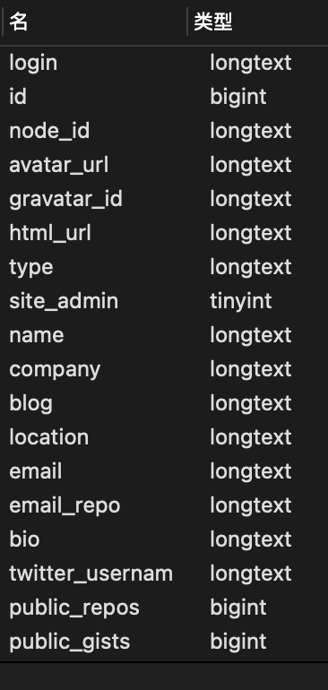

# Github 用户数据爬虫

## 项目简介
1. 此项目用于获取github用户注册数据，包括用户的用户名、邮箱、注册时间等信息。
2. 可用于查询github注册用户邮箱及相关数据
3. 可用于批量爬取github注册用户数据
4. 可检索提供的github token剩余查询次数

## 原理


## 使用

1. 运行初始化命令
```shell
❯ GatherGithubInfo init -I 127.0.0.1 -P 3306 -u root -p 123456 -d github
```
2. 运行爬虫
```shell
  -e, --endnum int     The number of users you want to end crawling
  -h, --help           help for crawl
  -p, --perpage int    The number of users you want to crawl perpage
  -s, --startnum int   The number of users you want to start crawling
  -t, --token string   The github token
  -u, --user string    The single github user you want to crawl
```
单独爬取用户
```shell
❯ GatherGithubInfo crawl -u=dragon-yy  
```
批量爬取用户
```shell
❯ GatherGithubInfo crawl -s=2 -p=1 -e=3
```
指定github token爬取
```shell
❯ GatherGithubInfo crawl -s=2 -p=1 -e=3 -t=xxxx
```

爬取字段包含


# TODO

 - 代理池创建 
 - 多线程优化

